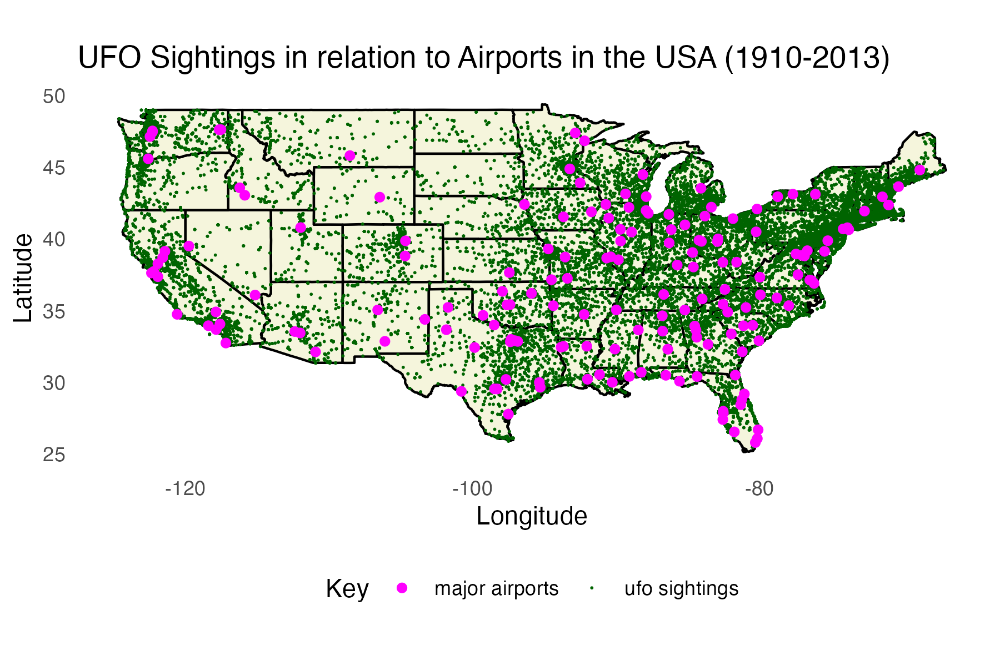
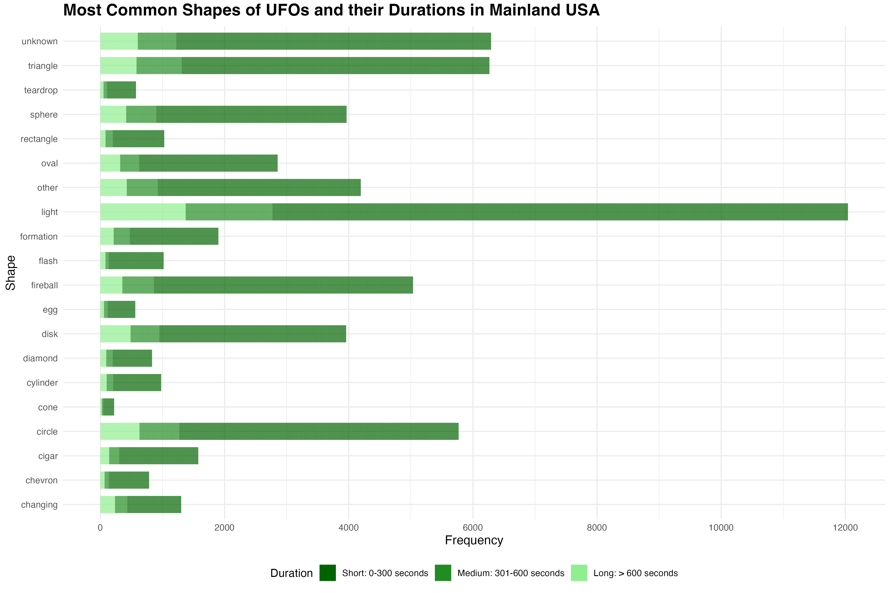

# **Investigating the Relationship Between Major Airport Locations and UFO Sightings in Mainland USA**


## Background & Research Questions

The phenomenon of unidentified flying objects (UFOs) has captivated the imagination of people around the world for decades. While I don't particularly admire Donald Trump, his decision to express interest in releasing information regarding UFOs and extraterrestrial intelligence, particularly evidenced by the Pentagon's release of UAP videos in 2020, was intriguing. While many sightings remain unexplained, steps have been taken to allow individuals to document their sightings, including factors such as location, duration, shape, and date. For example, The National UFO Reporting Center [NUFORC](https://nuforc.org/) is a widely recognized organization dedicated to collecting and analyzing reports of UFOs from across the United States and beyond. However, the reliability of these sightings are often called into question due to various factors such as misidentifications, hoaxes, and the subjective nature of eyewitness testimony. As such, I wanted to invesigate whether there were any correlations between the locations of these sightings and the loacations of major airports in the USA.

## Research Aims:
### Aim 1
To Determine Spatial Patterns: Investigate whether there are spatial correlations between the locations of major airports and reported UFO sightings in mainland USA.

### Aim 2
To Identify Common Shapes: Analyze the most commonly reported shapes of UFOs in sightings.

### Aim 3
To Assess the Duration of Sightings: Investigate the duration of UFO sightings in regard to the shape recorded.

## Data Origins
The raw UFO data was sourced from the NUFORC website, and processed by Sigmond Axel to include geolocated and time standardized reports, which is publicly accessible on [github](https://github.com/planetsig/ufo-reports).

The locations of major US airports was acquired from [data.world](https://data.world/ourairports/989444cc-447b-4030-a866-57fcd6c2d3ee) and sourced from [OurAirports](https://ourairports.com/countries/US/airports.html). This dataset includes all North American airports, and is publicly accessible. 

Additionally, the R package [maps](https://cran.r-project.org/web/packages/maps/index.html) was used to draw a geographical map of mainland USA, which provides access to a diverse collection of geographical data, particularly maps of the world, countries, and states/provinces of various countries.

## Project Organization
The project directory includes two main folders: "/data" and "/images". The "/data" folder contains essential datasets for the project, while the "/images" folder houses both images necessary for the project and visual outputs generated during visualization processes.

Additionally, a comprehensive codebook detailing all labels and abbreviations utilized within the project for data, variables, functions, and other relevant entities is available at the location "/codebook.xlsx". 

## **Data Preparation**
### Loading Packages
The project used the 'renv' package to preserve package versions of the libraries used. The package versions used in this project are listed in the file /renv.lock

```{r loadlib, echo = TRUE, results = 'hide', warning = FALSE, message = FALSE}
#load packages with renv

if (!require('renv')) 
{
  install.packages('renv');
}
library(renv)
renv::restore()

#import packages
library(tidyverse)
library(ggplot2)
library(dplyr)
library(tidyr)
library(sf)
library(maps)
```

### Importing data
```{r import data}
#load UFO data
ufo_data <- read.csv("https://raw.githubusercontent.com/tomhbird/PSY6422_UFO_AIRPORTS/main/Raw/complete.nosync.csv")

#load US airport data
airport_data <- read.csv("https://raw.githubusercontent.com/tomhbird/PSY6422_UFO_AIRPORTS/main/Raw/list-of-airports-in-united-states-of-america-hxl-tags-1.nosync.csv")
```

### Cleaning the data
#### First UFO data
```{r data wrangling UFO, results='hide', warning=FALSE}
#trimming UFO data to only include mainland USA, removing Hawaii, Alaska, and Puerto Rico
ufo_data_usa <- ufo_data %>%
  filter(country == "us" & !(state %in% c("hi", "ak", "pr")))

#remove columns "comments," "duration..hours.min.," and "date.posted"
ufo_data_trim <- subset(ufo_data_usa, 
                        select = -c(comments, duration..hours.min., date.posted))

#detangle date.time column, spitting them into individual variables "date" and "time"
ufo_data_trim <- separate(ufo_data_trim, datetime, into = c("date", "time"), sep = " ")

#checking if latitude and longitude columns are in the correct data type
str(ufo_data_trim)

#as the latitude was a character column, it was converted into a numeric column 
ufo_data_trim$latitude <- as.numeric(ufo_data_trim$latitude)

#checking to see if it was successfully converted
str(ufo_data_trim$latitude)

# Convert duration column to numerical
ufo_data_trim$duration..seconds. <- as.numeric(ufo_data_trim$duration..seconds.)

# Verify the change
str(ufo_data_trim$duration..seconds.)

# Replace blank recordings of shape with "unknown"
ufo_data_trim <- ufo_data_trim %>%
  mutate(shape = ifelse(shape == "", "unknown", shape))

```

```{r displaying the UFO data}
#display table of first 6 UFO sightings data
knitr::kable(head(ufo_data_trim))
```

#### Second US airport data
```{r data wrangling airport, results='hide', warning=FALSE}

# Filter the dataset to include only entries where the type is "large_airport" and remove rows where both longitude and latitude are 0
airport_data_filtered <- airport_data %>%
  filter(type == "large_airport") %>%
  filter(longitude_deg != 0 | latitude_deg != 0)

#checking if latitude and longitude columns are in the correct data type
str(airport_data_filtered$longitude_deg)
str(airport_data_filtered$latitude_deg)

#as the longitude and latitude was a character column, they were converted into a numeric column 
airport_data_filtered$latitude_deg <- as.numeric(airport_data_filtered$latitude_deg)
airport_data_filtered$longitude_deg <- as.numeric(airport_data_filtered$longitude_deg)

#checking to see if it was successfully converted
str(airport_data_filtered$longitude_deg)
str(airport_data_filtered$latitude_deg)

#removing unecessary columns from airport dataframe
airport_data_filtered <- airport_data_filtered %>%
  select(-id, -ident, -elevation_ft, -continent, 
         -iso_country, -iso_region, -scheduled_service,
         -gps_code, -iata_code, -home_link, -wikipedia_link,
         -keywords, -score, -last_updated)
```

```{r displaying the airport data}
#display table of first 6 USA major airport data
knitr::kable(head(airport_data_filtered))
```

#### Third creating map of the USA
```{r creating map of USA}
# Plot map of USA
usa <- map("state", fill = TRUE, col = "transparent", plot = FALSE)

# Convert map data to data frame
usa_df <- fortify(usa)

```

## **Visualisations**
### UFO sightings plotted on a map of the USA in relation to major airport locations
```{r map plot, results = TRUE, warning=FALSE}
# define data to plot
ufo_map <- ggplot() +
  
  # Add the USA map polygons
  geom_polygon(data = usa_df, aes(x = long, y = lat, group = group), fill = "beige", color = "black") +
  
  # Add UFO sightings as points (darkgreen color)
  geom_point(data = ufo_data_trim, aes(x = longitude, y = latitude, fill = "ufo sightings"), color = "darkgreen", size = 0.01) +
  
  # Add airport locations as points (magenta color)
  geom_point(data = airport_data_filtered, aes(x = longitude_deg, y = latitude_deg, fill = "major airports"), color = "magenta", size = 1.5) +
  
  # Set the aspect ratio and limit the plot to the boundaries of the USA map
  coord_fixed(xlim = range(usa_df$long), ylim = range(usa_df$lat)) +
  
  # Add plot title
  labs(title = "UFO Sightings in relation to Airports in the USA (1910-2013)", x = "Longitude", y = "Latitude",
       color = "Data",
       fill = "Key") + # Change legend title
  
  # Set minimal theme with white background and remove grid lines
  theme_minimal() +
  theme(panel.background = element_rect(fill = "white", color = NA),
        panel.grid.major = element_blank(),
        panel.grid.minor = element_blank()) +
  
  # Customize x and y axes
  scale_x_continuous("Longitude", limits = range(usa_df$long)) +
  scale_y_continuous("Latitude", limits = range(usa_df$lat)) +
  
  # Position the legend at the bottom of the plot
  theme(legend.position = "bottom")

# Save the graph as an image
ggsave("images/ufo_map.png", plot = ufo_map, width = 6, height = 4, dpi = 300)
```

## Aim 1:
To Determine Spatial Patterns: Investigate whether there are spatial correlations between the locations of major airports and reported UFO sightings in mainland USA.




### Creating stacked bar graph to show the most common shapes of UFO and their durations in mainland USA
```{r creating a dataframe for the 20 most reported ufo shapes}
#catagorising the top 20 most reported ufo shapes
# Count the frequency of each UFO shape
ufo_shape_counts <- table(ufo_data_trim$shape)

# Convert the table to a data frame
ufo_shape_df <- as.data.frame(ufo_shape_counts)
names(ufo_shape_df) <- c("shape", "count")

# Sort the data frame by count in descending order
ufo_shape_df <- ufo_shape_df[order(-ufo_shape_df$count), ]

# Select top 20 shapes
ufo_shape_top20 <- head(ufo_shape_df, 20)
```

```{r shape and duration stacked bar graph, results = TRUE, warning=FALSE}
# Calculate quantiles of duration
quantiles <- quantile(ufo_data_trim$duration..seconds., probs = c(0, 0.25, 0.5, 0.75, 1), na.rm = TRUE)

# As there were extreme outliers in the upper bounds, remove them (as this data ranges from 1910-2013, some of the durations recorded may be inaccurate)
# Define upper and lower bounds
Q1 <- quantiles["25%"]
Q3 <- quantiles["75%"]
IQR <- Q3 - Q1
lower_bound <- Q1 - 1.5 * IQR
upper_bound <- Q3 + 1.5 * IQR

# Filter data to remove outliers
ufo_data_trim_filtered <- ufo_data_trim[ufo_data_trim$duration..seconds. >= lower_bound & ufo_data_trim$duration..seconds. <= upper_bound, ]

# Create a new variable for duration categories
ufo_data_trim_filtered$duration_category <- cut(ufo_data_trim_filtered$duration..seconds., breaks = c(-Inf, 0, 300, 600, Inf), labels = c("Short", "Short", "Medium", "Long"))

# Combine both data frames
combined_data <- merge(ufo_shape_top20, ufo_data_trim_filtered, by = "shape")

# Set count to 1 for every data point
combined_data <- combined_data %>% 
  mutate(count = 1)

# Create a stacked bar plot to visualize the frequency of top 20 UFO shapes and their durations

# Define data to plot
stacked_barchart <- ggplot(combined_data, aes(x = reorder(shape, count), y = count, fill = duration_category)) +

# Add stacked bars representing the frequency of each UFO shape and duration category
  geom_bar(stat = "identity", position = "stack", width = 0.7) +

# Add plot title and axis labels
  labs(title = "Most Common Shapes of UFOs and their Durations in Mainland USA",
       x = "Shape",
       y = "Frequency",
       fill = "Duration") +

# Manually set fill colors for each duration category
  scale_fill_manual(values = c("Short" = "darkgreen", "Medium" = "forestgreen", "Long" = "lightgreen")) +

# Flip the x and y coordinates to create a horizontal bar plot
  coord_flip() +

# Set breaks for the y-axis to ensure proper scale
  scale_y_continuous(breaks = c(0, 2000, 4000, 6000, 8000, 10000, 12000, 14000)) +

# Apply a minimal theme with white background and bottom legend
  theme_minimal() +
  theme(axis.title = element_text(size = 12),       # Customize axis title font size
  plot.title = element_text(size = 16, face = "bold"),  # Customize plot title font size and style
  legend.position = "bottom")                 # Position legend at the bottom of the plot

# Save the graph as an image
ggsave("images/stacked_barchart.png", plot = stacked_barchart, width = 10, height = 4, dpi = 300)

```

